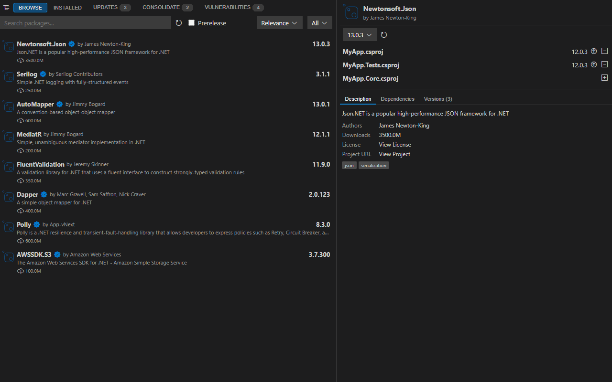
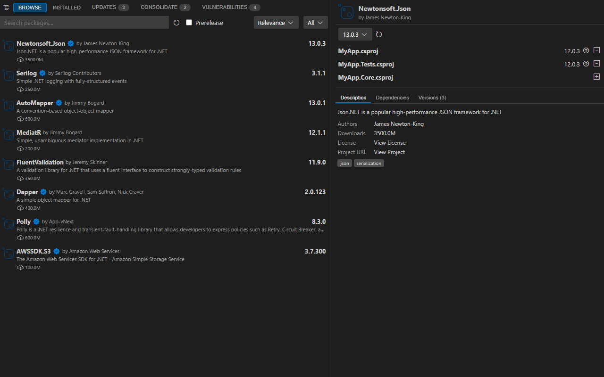
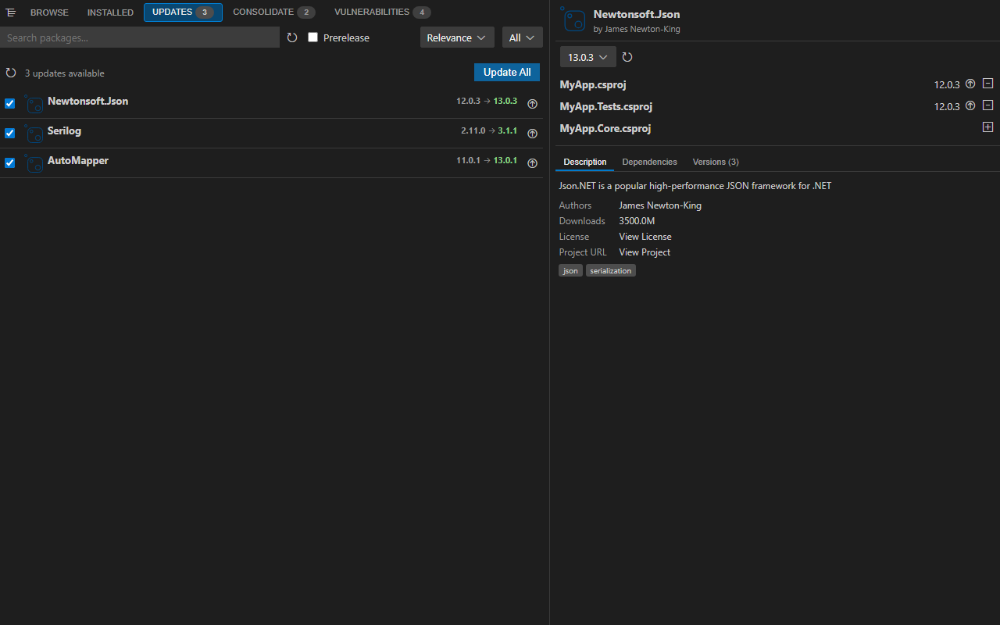
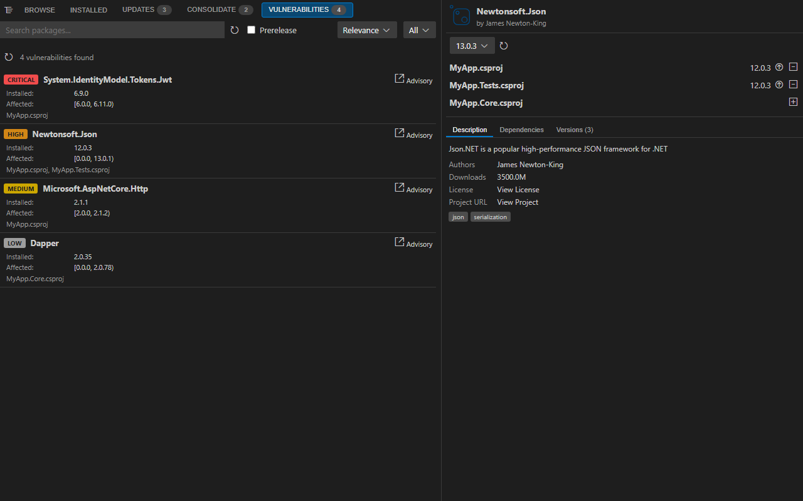
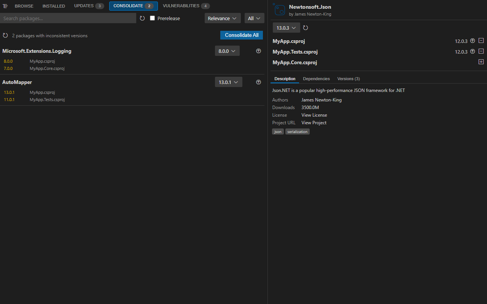

# NuGet Workbench

**A full-featured NuGet package manager for Visual Studio Code** — browse, install, update, and audit packages across all your .NET projects without leaving the editor.

[](https://marketplace.visualstudio.com/items?itemName=nuget-workbench.nuget-workbench)
[](https://marketplace.visualstudio.com/items?itemName=nuget-workbench.nuget-workbench)
[](https://github.com/nuget-workbench/nuget-workbench-vscode/releases)
[](https://github.com/nuget-workbench/nuget-workbench-vscode/actions)
[](LICENSE)
[](https://code.visualstudio.com/)

---



---

## Table of Contents

- [Features](#features)
- [Requirements](#requirements)
- [Installation](#installation)
- [Getting Started](#getting-started)
- [Tabs & Workflows](#tabs--workflows)
  - [Browse](#browse)
  - [Installed](#installed)
  - [Updates](#updates)
  - [Vulnerabilities](#vulnerabilities)
  - [Consolidate](#consolidate)
- [Project Tree](#project-tree)
- [Commands](#commands)
- [Configuration](#configuration)
- [Private Feed Authentication](#private-feed-authentication)
- [Central Package Management (CPM)](#central-package-management-cpm)
- [Inline Version Decorations](#inline-version-decorations)
- [Contributing](#contributing)
- [Architecture](#architecture)
- [Credits](#credits)
- [License](#license)

---

## Features

| | Feature | Description |
|---|---|---|
| 📦 | **Browse & Install** | Search nuget.org and private feeds, install into one or multiple projects at once |
| 🔄 | **One-click Updates** | See all outdated packages with version diffs, update individually or all at once |
| 🛡️ | **Vulnerability Scanning** | Color-coded CVE severity badges (Critical / High / Medium / Low) with advisory links |
| 🔀 | **Version Consolidation** | Find and fix version inconsistencies across projects in a single click |
| 🌲 | **Project Tree** | Checkbox-based project selector — scope every operation to exactly the projects you want |
| 🔐 | **Private Feeds** | Reads `NuGet.config`, supports Azure Artifacts Credential Provider and custom password scripts |
| 📌 | **CPM Support** | Full Central Package Management — detects `Directory.Packages.props`, tracks version sources |
| ✏️ | **Inline Decorations** | Optional gutter hints in `.csproj` files showing available updates right in the editor |
| ⌨️ | **Keyboard Accessible** | Full keyboard navigation and ARIA support across all interactive elements |

---

## Requirements

- Visual Studio Code **1.87** or later
- A workspace containing `.csproj`, `.fsproj`, or `.sln` files
- **.NET SDK** installed and on `PATH` (for install / update / restore operations)

---

## Installation

### From the Marketplace (recommended)

1. Open VS Code
2. Press `Ctrl+Shift+X` to open the Extensions panel
3. Search for **NuGet Workbench**
4. Click **Install**

Or install directly from the command line:

```bash
code --install-extension nuget-workbench.nuget-workbench
```

### From a .vsix file

Download the latest `.vsix` from the [Releases page](https://github.com/nuget-workbench/nuget-workbench-vscode/releases), then:

```bash
code --install-extension nuget-workbench-x.x.x.vsix
```

Or via the Extensions panel: click **···** → **Install from VSIX…**

---

## Getting Started

1. Open a folder or workspace that contains `.csproj` / `.fsproj` / `.sln` files — the extension activates automatically.
2. Open the **NuGet** panel at the bottom of VS Code (next to Terminal, Problems, etc.).
3. Your projects appear in the **project tree** on the left. All are selected by default.
4. Use the **BROWSE** tab to search for and install packages.
5. Run **UPDATES** to check for outdated packages, **VULNERABILITIES** for security issues, and **CONSOLIDATE** to fix version drift across projects.

> **Tip:** Use the Command Palette (`Ctrl+Shift+P`) and type `NuGet Workbench` to jump directly to any feature.

---

## Tabs & Workflows

### Browse



Search nuget.org (or any configured feed) and install packages into your projects.

- **Search bar** at the top — results update as you type
- **Source dropdown** — filter to a specific feed or search across all
- **Prerelease toggle** — include pre-release versions in results
- **Package list** (left pane) — click any row to load full details
- **Detail panel** (right pane) — description, authors, download count, license, tags, version picker, and per-project install/uninstall buttons
- **Project rows** — show the currently installed version per project; install, update to a specific version, or uninstall individually

### Installed

Shows every package installed across all selected projects. Use this tab to quickly uninstall or change versions without leaving the package list.

### Updates



Lists all packages where a newer version is available on the configured sources.

- Each row shows the **installed version → latest version** with source attribution
- **Select individual packages** with checkboxes, then click **Update All** to apply in one go
- Per-row **update button** for single-package updates
- Counts on the tab badge update in real time

### Vulnerabilities



Scans installed packages against the NuGet vulnerability database.

- Severity badges: **CRITICAL** · **HIGH** · **MEDIUM** · **LOW**
- Affected version range shown for each entry
- **Advisory** link opens the GitHub Security Advisory in your browser
- Affected projects listed below each vulnerable package

### Consolidate



Detects packages that are installed at different versions across your projects.

- Groups packages by ID, shows which project uses which version (latest highlighted in orange, older in yellow)
- **Version dropdown** per package — pick the target version to consolidate to
- **Consolidate** button applies to a single package; **Consolidate All** fixes all at once
- Respects Central Package Management — CPM-managed packages are labelled accordingly

---

## Project Tree

The collapsible project tree on the left of the main view lets you scope operations:

- **Check / uncheck** individual projects to include or exclude them from searches and batch operations
- **CPM badge** displayed next to projects where `Directory.Packages.props` is detected
- Supports C# (`.csproj`), F# (`.fsproj`), and VB.NET (`.vbproj`) project files
- Projects discovered recursively from the workspace root, excluding `node_modules`, `bin`, `obj`

---

## Commands

Access these from the Command Palette (`Ctrl+Shift+P`):

| Command | ID | Description |
|---|---|---|
| **NuGet Workbench: Open Packages** | `nugetWorkbench.open` | Focus the NuGet panel |
| **NuGet Workbench: Add Package** | `nugetWorkbench.install` | Prompt for a package ID and open Browse with it pre-searched |
| **NuGet Workbench: Update Package** | `nugetWorkbench.update` | Focus the NuGet panel and switch to the Updates tab |
| **NuGet Workbench: Remove Package** | `nugetWorkbench.remove` | Focus the NuGet panel and switch to the Installed tab |
| **Settings** | `nugetWorkbench.openSettings` | Open the NuGet Workbench settings view |
| **Report Problem** | `nugetWorkbench.reportProblem` | Open a new GitHub issue |

---

## Configuration

Open VS Code Settings (`Ctrl+,`) and search for **NuGet Workbench**, or edit `settings.json` directly.

| Setting | Type | Default | Description |
|---|---|---|---|
| `NugetWorkbench.sources` | `string[]` | `[nuget.org]` | List of NuGet feed URLs to search and update from. Each entry is a JSON string `{"name":"...","url":"..."}`. |
| `NugetWorkbench.defaultSource` | `string` | `""` | Default source URL pre-selected in the source dropdown. Empty = use the first configured source. |
| `NugetWorkbench.prerelease` | `boolean` | `false` | Include pre-release versions when checking for updates. |
| `NugetWorkbench.skipRestore` | `boolean` | `false` | Skip the restore preview and compatibility check when installing/updating packages. |
| `NugetWorkbench.enablePackageVersionInlineInfo` | `boolean` | `false` | Show inline gutter decorations in `.csproj` files with available update versions. |
| `NugetWorkbench.statusBarLoadingIndicator` | `boolean` | `false` | Show a loading progress indicator in the VS Code status bar. |
| `NugetWorkbench.pageSize` | `number` | `20` | Number of packages returned per search page. |
| `NugetWorkbench.showOutputOnError` | `boolean` | `true` | Automatically reveal the NuGet output log when an operation fails. |
| `NugetWorkbench.logLevel` | `"DEBUG"` \| `"INFO"` \| `"WARN"` \| `"ERROR"` | `"INFO"` | Minimum log level written to the NuGet Workbench output channel. |

### Example `settings.json`

```jsonc
{
  "NugetWorkbench.sources": [
    "{\"name\": \"nuget.org\", \"url\": \"https://api.nuget.org/v3/index.json\"}",
    "{\"name\": \"My Feed\",   \"url\": \"https://pkgs.dev.azure.com/my-org/_packaging/my-feed/nuget/v3/index.json\"}"
  ],
  "NugetWorkbench.prerelease": false,
  "NugetWorkbench.enablePackageVersionInlineInfo": true,
  "NugetWorkbench.skipRestore": false
}
```

---

## Private Feed Authentication

NuGet Workbench supports private package feeds out of the box.

### NuGet.config (automatic)

The extension reads credentials stored in any `NuGet.config` file in your workspace or the global `%APPDATA%\NuGet\NuGet.Config`. If your feed credentials are already configured there, no extra setup is needed.

### Azure Artifacts Credential Provider

Install the [Microsoft Artifacts Credential Provider](https://github.com/microsoft/artifacts-credprovider) and authenticate once via the .NET CLI:

```bash
dotnet restore --interactive
```

The credential provider handles token refresh automatically.

### Custom Password Script

For non-standard authentication flows, configure a script path per source. The script receives the feed URL as an argument and must print the password to stdout:

```jsonc
// settings.json
{
  "NugetWorkbench.sources": [
    "{\"name\": \"Internal\", \"url\": \"https://my.internal.feed/v3/index.json\", \"passwordScriptPath\": \"/path/to/get-token.sh\"}"
  ]
}
```

---

## Central Package Management (CPM)

NuGet Workbench has first-class support for [Central Package Management](https://learn.microsoft.com/en-us/nuget/consume-packages/central-package-management).

- **Auto-detection** — projects using `Directory.Packages.props` are detected and labelled in the project tree
- **Version source tracking** — each installed package shows whether its version comes from `project`, `central`, or `override`
- **Consolidate** — understands CPM boundaries and applies consolidation correctly
- **Restore handling** — uses the correct `dotnet` invocation for CPM workspaces

---

## Inline Version Decorations

Enable `NugetWorkbench.enablePackageVersionInlineInfo` to see available updates directly in your project files:

```xml
<PackageReference Include="Newtonsoft.Json" Version="12.0.3" />  ← 13.0.3 available
```

Decorations appear in the gutter next to `<PackageReference>` entries whenever a newer version exists on your configured sources. Click the decoration to open the package in the NuGet panel.

---

## Contributing

Contributions are welcome — bug reports, feature requests, documentation improvements, and pull requests.

### Reporting Issues

Please use the [GitHub Issues](https://github.com/nuget-workbench/nuget-workbench-vscode/issues) tracker. Include:
- VS Code version
- Extension version
- Steps to reproduce
- Relevant output from the **NuGet Workbench** output channel (set `logLevel` to `DEBUG`)

### Development Setup

**Prerequisites:** Node.js 18+, npm

```bash
# 1. Clone the repository
git clone https://github.com/nuget-workbench/nuget-workbench-vscode.git
cd nuget-workbench-vscode

# 2. Install dependencies
npm install

# 3. Build the extension
npm run esbuild
```

### Running & Debugging

Press **F5** in VS Code to launch a new Extension Development Host window with the extension loaded. The host reloads automatically after `npm run esbuild`.

### Code Style

```bash
npm run lint          # Check for lint errors (ESLint 9)
npm run lint:fix      # Auto-fix fixable issues
```

- **TypeScript strict mode** — `any` is a warning, avoid it
- Unused variables: prefix with `_` to suppress the warning
- CSS in Lit components uses the `css` tagged template literal and VS Code CSS variables (`--vscode-*`)
- All written content in English: code comments, commit messages, JSDoc, documentation

### Running Tests

```bash
npm test              # Full test suite (VSCode Test CLI + Mocha)
npm run test-compile  # Type-check tests only (no execution)
```

Tests live alongside source files as `*.test.ts`. The test runner opens a headless VS Code Extension Host.

### Updating Screenshots

After UI changes, regenerate the screenshots and animated GIF automatically:

```bash
npm run esbuild          # Rebuild bundles first
npm run screenshot       # Generates docs/images/*.png and docs/images/demo.gif
```

The script (`tools/take-screenshots.mjs`) starts a local HTTP server, loads the UI with mock data in a headless Chromium browser via Playwright, captures each tab, and assembles the animated GIF.

### Building a .vsix Package

```bash
npm run package
# → releases/nuget-workbench-x.x.x.vsix
```

### Pull Request Guidelines

1. Fork the repository and create a feature branch from `main`
2. Make your changes — small, focused PRs are easier to review
3. Add or update tests for changed behaviour
4. Run `npm run lint` and `npm test` — both must pass
5. Write a clear PR description explaining the **why**, not just the **what**
6. Reference any related issues with `Closes #123`

Commit messages follow [Conventional Commits](https://www.conventionalcommits.org/):
`feat:`, `fix:`, `refactor:`, `chore:`, `docs:`, `test:`, `perf:`

---

## Architecture

The extension runs in two isolated processes that communicate via a typed RPC layer over `postMessage`:

```
┌─────────────────────────────────────────────┐   ┌──────────────────────────────────────────────┐
│  VS Code Extension Host  (Node.js)           │   │  Webview  (Browser / Lit)                    │
│                                             │   │                                              │
│  extension.ts                               │   │  main.ts  →  nuget-workbench (root element) │
│  host-api.ts  ──  RpcHost                  │◄──►│  RpcClient  →  packages-view                │
│  nuget/api.ts  (axios → NuGet API)         │   │  components/*  (@state, @property)           │
│  utilities/  (csproj parser, decorator)    │   │  registrations.ts  (singletons)              │
└─────────────────────────────────────────────┘   └──────────────────────────────────────────────┘
         postMessage RPC: { type, id, method, params } / { type, id, result }
```

**Key design decisions:**

- **Typed RPC** — `HostAPI` interface in `src/common/rpc/types.ts` is the single source of truth for all IPC. Every method returns `Result<T>` (a discriminated union), so error paths are always explicit.
- **Lit web components** — the entire UI is built with LitElement + native HTML elements styled via VS Code CSS variables. No frameworks, no heavy dependencies in the webview bundle.
- **Dual bundle** — esbuild produces two separate bundles: `dist/extension.js` (Node.js CommonJS for the host) and `dist/web.js` (ESM for the webview).

**Source layout:**

```
src/
├── common/            # Shared between host and web (types, RPC protocol, utilities)
│   ├── rpc/           # RpcHost, RpcClient, types, Result<T>
│   └── types.ts       # Domain types (Package, Project, Configuration, …)
├── host/              # Extension host (Node.js context)
│   ├── extension.ts   # Activation, command registration, WebviewViewProvider
│   ├── host-api.ts    # HostAPI implementation
│   └── nuget/         # NuGet API client (axios), .csproj / .sln parsing
└── web/               # Webview UI (browser context)
    ├── main.ts         # Root element, routing
    ├── components/     # LitElement components (packages-view, updates-view, …)
    ├── styles/         # Shared CSS (VS Code variables, codicons, scrollbars)
    └── registrations.ts# Module-level singletons (hostApi, router, configuration)
```

---

## Credits

NuGet Workbench builds on the work of:

- [pcislo/vscode-nuget-gallery](https://github.com/pcislo/vscode-nuget-gallery) by [Patryk Cislo](https://github.com/pcislo) — the original extension this project descends from
- [shis91/vscode-nuget-gallery](https://github.com/shis91/vscode-nuget-gallery) by [shis91](https://github.com/shis91) — major feature additions including CPM, authentication, and test infrastructure

---

## License

[MIT](LICENSE)
